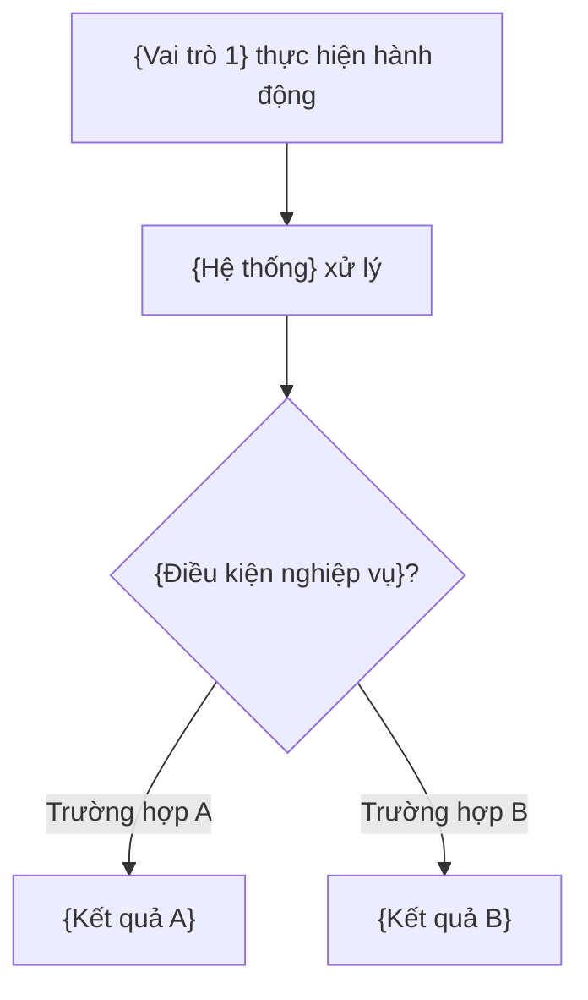
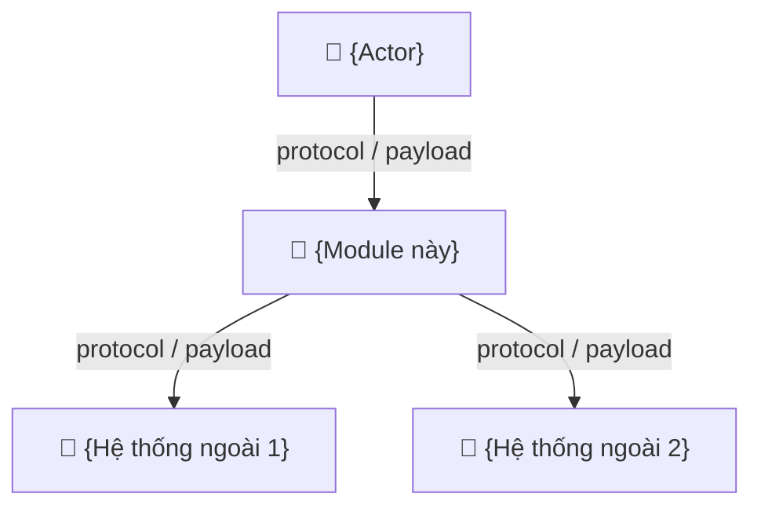
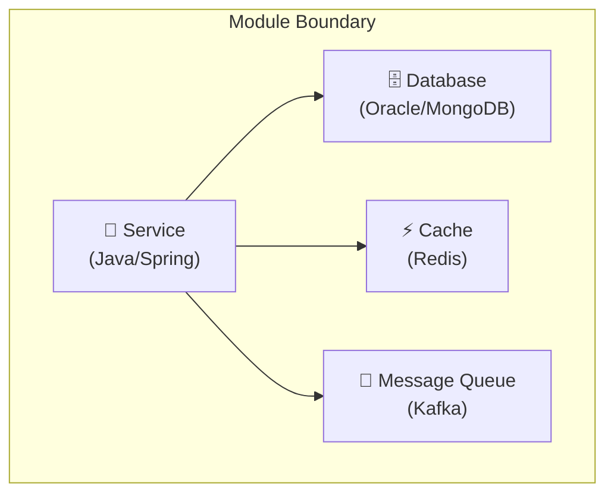
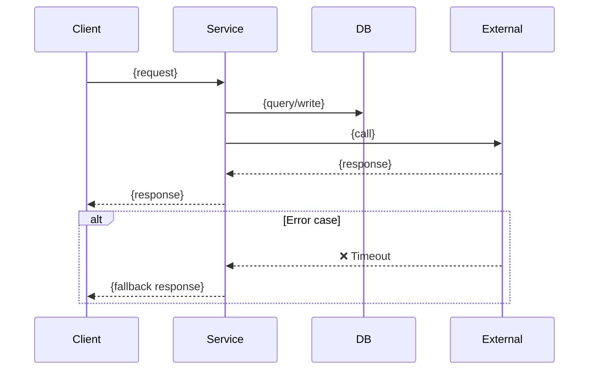

# {Tên Module} — Technical Design Document

> **Kiến trúc sư:** {tên} | **Quản lý / Tham vấn:** {tên} | **Cập nhật:** {YYYY-MM}
>
> **Trạng thái**: Draft | In Review | Approved | Deprecated
> **Tác giả**: {tên}
> **Ngày tạo**: {YYYY-MM-DD}
> **Lần cập nhật cuối**: {YYYY-MM-DD}
> **Reviewer**: {tên1, tên2}
> **Ticket liên quan**: {JIRA/linear-link}

---

## Mục lục

- [T0 — Bối cảnh Nghiệp vụ (Ý tưởng \& Flow)](#t0--bối-cảnh-nghiệp-vụ)
- [T1 — Chiến lược (Vấn đề \& Mục tiêu)](#t1--chiến-lược)
- [T2 — Kiến trúc (Thiết kế Hệ thống)](#t2--kiến-trúc)
- [T3 — Quyết định (Lựa chọn \& ADR)](#t3--quyết-định)
- [T4 — Vận hành (SLO, Rollout, Monitoring)](#t4--vận-hành)
- [Phụ lục](#phụ-lục)
- [Checklist Review](#checklist-review)

---

## T0 — Bối cảnh Nghiệp vụ

> **Quy tắc**: Viết bằng ngôn ngữ tự nhiên. KHÔNG dùng tên class, tên pattern, hay thuật ngữ kỹ thuật.

### Tổng quan nghiệp vụ

> Giải thích module này giải quyết bài toán kinh doanh gì, phục vụ ai, trong bối cảnh nào.
> Viết sao cho một người không biết lập trình đọc xong vẫn hiểu.

{Mô tả 2-3 đoạn bằng ngôn ngữ tự nhiên}

### Flow nghiệp vụ (User Journey)

> Flowchart mô tả trải nghiệm end-to-end từ góc nhìn người dùng.
> Dùng tên vai trò (Kế toán, Giám đốc, Nhân viên) thay vì tên component.



### Quy tắc kinh doanh (Business Rules)

> Liệt kê các quy tắc nghiệp vụ mà module phải tuân thủ.
> Viết bằng bullet points, ngôn ngữ tự nhiên, kèm ví dụ cụ thể.

- {Quy tắc 1} — Ví dụ: "{tình huống cụ thể}"
- {Quy tắc 2} — Ví dụ: "{tình huống cụ thể}"
- {Quy tắc 3}

### Ví dụ thực tế (Scenario)

> Mô tả 1-2 kịch bản thực tế (happy path + unhappy path) bằng ngôn ngữ tự nhiên.

**Kịch bản 1 — Happy path**:
> {Vai trò} tại {công ty} cần {thực hiện nghiệp vụ}. {Mô tả từng bước user trải qua}. Kết quả: {outcome}.

**Kịch bản 2 — Unhappy path**:
> {Mô tả tình huống lỗi/ngoại lệ và cách hệ thống xử lý từ góc nhìn user}.

### Thuật ngữ nghiệp vụ

| Thuật ngữ | Ý nghĩa | Ví dụ |
|-----------|---------|-------|
| {Thuật ngữ 1} | {giải thích} | {ví dụ} |
| {Thuật ngữ 2} | {giải thích} | {ví dụ} |

---

> **Ranh giới T0 ↔ T1**: Từ đây trở xuống là nội dung kỹ thuật dành cho Dev và Architect.
> BA/PM/Stakeholder có thể dừng đọc tại đây.

---

## T1 — Chiến lược

### Bối cảnh vấn đề

> Mô tả vấn đề kinh doanh hoặc kỹ thuật đang gặp phải.
> Bao gồm: ai bị ảnh hưởng, mức độ nghiêm trọng, tần suất xảy ra.
> Nêu bằng chứng (metrics, incidents, user feedback) — không chỉ giả định.

### Mục tiêu đo lường được

Liệt kê rõ ràng — mỗi mục tiêu phải **kiểm chứng** được bằng metric cụ thể:

| # | Mục tiêu | Metric hiện tại | Metric mục tiêu | Cách đo |
|---|----------|-----------------|------------------|---------|
| G1 | {mô tả} | {con số hiện tại} | {con số mục tiêu} | {công cụ/dashboard} |
| G2 | | | | |
| G3 | | | | |

> **Test kiểm chứng**: Sau 30 ngày deploy, bạn có thể kiểm tra mỗi metric ở trên không? Nếu không → mục tiêu chưa đủ cụ thể.

### Phạm vi (Scope)

#### Trong phạm vi (In-scope)

- {item 1}
- {item 2}

#### Ngoài phạm vi (Out-of-scope) — và tại sao

| Item | Lý do loại trừ |
|------|----------------|
| {item} | {giải thích ngắn} |

### Stakeholder

| Vai trò | Tên/Team | Quan tâm chính | Quyền quyết định |
|---------|----------|----------------|-------------------|
| Sponsor | | | Approve / veto |
| Tech Lead | | | Design decisions |
| SRE / Ops | | | Vận hành |
| Consumer team | | | Integration |

### Ràng buộc cứng

Liệt kê các constraint không thể thương lượng:

| Ràng buộc | Loại | Nguồn gốc |
|-----------|------|-----------|
| {ví dụ: latency < 200ms} | Performance | SLA hợp đồng |
| {ví dụ: data phải ở VN region} | Compliance | Quy định NHNN |
| {ví dụ: budget ≤ $500/tháng} | Cost | CFO approval |

---

## T2 — Kiến trúc

### Design Patterns Tổng Hợp

> Bảng tổng hợp các design pattern được áp dụng trong module.

| Pattern | Áp dụng tại | Vai trò |
|---------|-------------|---------|
| {pattern 1} | {class/component} | {giải thích ngắn} |
| {pattern 2} | {class/component} | {giải thích ngắn} |

### Sơ đồ bối cảnh hệ thống (C4 Level 1)

> Hiển thị module này tương tác với actors và systems bên ngoài nào.



**Mô tả**: {1-2 đoạn giải thích sơ đồ, nhấn mạnh ranh giới trust và failure domain}

### Sơ đồ Container (C4 Level 2)

> Hiển thị các deployable units bên trong module.



**Mô tả**: {giải thích mỗi container, tại sao tách biệt, failure mode khi mỗi container chết}

### Data Flow chính

> Mô tả luồng dữ liệu cho use case chính (happy path + error path).



### Data Model

> Liệt kê entities chính, relationships, và storage strategy.

| Entity | Storage | Retention | Indexes đáng chú ý |
|--------|---------|-----------|---------------------|
| {entity1} | {Oracle/MongoDB/Redis} | {policy} | {index list} |
| {entity2} | | | |

### Ranh giới Failure & Trust

| Ranh giới | Loại | Điều gì xảy ra khi fail | Mitigation |
|-----------|------|--------------------------|------------|
| {Service → DB} | Network | {mô tả impact} | {retry/circuit breaker/fallback} |
| {Service → External} | Trust boundary | {mô tả impact} | {timeout/validation/rate limit} |

### Code Examples (NÊN / KHÔNG NÊN)

> Minh họa cách sử dụng đúng pattern của module.

#### ✅ NÊN

```java
// {Mô tả cách làm đúng}
{code đúng pattern}
```

#### ❌ KHÔNG NÊN

```java
// {Mô tả anti-pattern và vì sao không nên}
{code sai}
```

### Checklist: Thêm {feature} mới (tùy chọn)

> Nếu module định nghĩa pattern mà developer cần follow, bổ sung bảng checklist.

| Bước | Tạo | Kế thừa | Ví dụ |
|------|-----|---------|-------|
| 1 | {file/class cần tạo} | {base class} | {tên cụ thể} |
| 2 | | | |
| 3 | | | |

---

## T3 — Quyết định

### Tổng hợp các quyết định kiến trúc

| # | Quyết định | Trạng thái | ADR |
|---|-----------|------------|-----|
| D1 | {mô tả ngắn} | Accepted | [ADR-0001](../{module}-adr/0001-title.md) |
| D2 | {mô tả ngắn} | Proposed | [ADR-0002](../{module}-adr/0002-title.md) |

### Chi tiết — Quyết định D1: {tên}

> Tóm tắt ngắn ở đây. ADR đầy đủ nằm trong file riêng.

**Bối cảnh**: {1-2 câu về tại sao cần quyết định này}

**Alternatives đã xem xét**:

| Tiêu chí (trọng số) | Alternative A | Alternative B | Alternative C (đã chọn) |
|----------------------|---------------|---------------|--------------------------|
| {tiêu chí 1} (40%) | ⚠️ {đánh giá} | ❌ {đánh giá} | ✅ {đánh giá} |
| {tiêu chí 2} (30%) | ✅ | ⚠️ | ⚠️ |
| {tiêu chí 3} (20%) | ❌ | ✅ | ✅ |
| {tiêu chí 4} (10%) | ✅ | ✅ | ⚠️ |
| **Tổng điểm** | **X.X** | **X.X** | **X.X** |

**Trade-off chấp nhận**: {ghi rõ cái mất khi chọn C thay vì A hoặc B}

**Evidence / Bằng chứng**:
- {link benchmark, PoC, incident, production data}
- {source: UA Knowledge Graph node / Socraticode search / DB schema}

### Chi tiết — Quyết định D2: {tên}

> (Lặp lại format trên cho mỗi quyết định)

---

## T4 — Vận hành

### SLI / SLO

| SLI | SLO Target | Đo bằng gì | Alert threshold | Escalation |
|-----|------------|-------------|-----------------|------------|
| Availability | {99.9%} | {uptime check / error rate} | {< 99.5% trong 5 phút} | {PagerDuty → team lead} |
| Latency P99 | {< 500ms} | {APM traces} | {> 1s trong 1 phút} | {Slack alert} |
| Error rate | {< 0.1%} | {log metrics} | {> 1% trong 5 phút} | {auto-scale + alert} |

### Observability

| Signal | Tool | Dashboard/Query |
|--------|------|-----------------|
| Metrics | {Prometheus/Grafana} | {link} |
| Logs | {ELK/Loki} | {query pattern} |
| Traces | {Jaeger/Zipkin} | {service name} |
| Alerts | {PagerDuty/AlertManager} | {rule name} |

### Rollout Plan

| Phase | Scope | Duration | Rollback trigger | Owner |
|-------|-------|----------|-------------------|-------|
| 1 — Canary | {5% traffic} | {2 giờ} | {error rate > 1%} | {tên} |
| 2 — Progressive | {50% traffic} | {1 ngày} | {latency P99 > 1s} | {tên} |
| 3 — Full rollout | {100%} | {1 ngày} | {bất kỳ SLO breach} | {tên} |

### Rollback Plan

| Trigger | Action | RTO | Owner |
|---------|--------|-----|-------|
| {SLO breach} | {revert deployment} | {< 5 phút} | {tên} |
| {data corruption} | {restore from backup} | {< 30 phút} | {DBA} |

### Security

| Threat | Mitigation | Verify bằng |
|--------|------------|-------------|
| {ví dụ: SQL injection} | {prepared statements} | {SAST scan} |
| {ví dụ: MITM} | {mTLS} | {cert rotation check} |

### Cost Estimate

| Resource | Monthly cost | Scaling trigger |
|----------|-------------|-----------------|
| {Compute} | {$X} | {CPU > 80%} |
| {Storage} | {$X} | {disk > 70%} |
| {Network} | {$X} | {bandwidth limit} |
| **Tổng** | **{$X}** | |

### Deprecation Strategy

> Nếu module này thay thế module cũ:

| Phase | Timeline | Action | Dependency |
|-------|----------|--------|------------|
| Announce | {T+0} | {thông báo team} | — |
| Dual-run | {T+2 tuần} | {chạy song song} | {feature flag} |
| Sunset | {T+1 tháng} | {tắt module cũ} | {migration complete} |

### Configuration Reference

> Bảng cấu hình chính của module.

| Config | Mô tả | Default |
|--------|-------|---------|
| {config key 1} | {mô tả chức năng} | {giá trị mặc định hoặc file tham chiếu} |
| {config key 2} | {mô tả chức năng} | {giá trị mặc định} |

---

## Phụ lục

### Thuật ngữ

| Thuật ngữ | Định nghĩa |
|-----------|------------|
| {term} | {definition} |

### Tài liệu tham khảo

- {link 1}
- {link 2}

### Lịch sử thay đổi

| Ngày | Phiên bản | Thay đổi | Tác giả |
|------|-----------|----------|---------|
| {ngày} | v0.1 | Bản draft đầu tiên | {tên} |

---

**[← TDD trước](./prev-TDD.md)** | **[Mục lục](./00-index.md)** | **[TDD tiếp theo →](./next-TDD.md)**

---

## Checklist Review

Chạy trước khi đánh dấu TDD là "Ready for Review":

### T0 — Bối cảnh Nghiệp vụ
- [ ] Viết hoàn toàn bằng **ngôn ngữ tự nhiên** — không class name, không pattern name
- [ ] Flowchart dùng **tên vai trò** (Kế toán, Giám đốc) thay vì tên component
- [ ] Business rules có **ví dụ cụ thể** kèm theo
- [ ] Có ít nhất **1 kịch bản thực tế** (happy path + unhappy path)
- [ ] Bảng thuật ngữ nghiệp vụ đầy đủ
- [ ] BA/PM đọc T0 **hiểu được** module làm gì mà không cần đọc T1-T4

### T1 — Chiến lược
- [ ] Mọi mục tiêu có **metric đo được** (không chỉ "cải thiện performance")
- [ ] Scope rõ ràng — có cả "ngoài phạm vi" với lý do
- [ ] Stakeholder đã được list và xác nhận
- [ ] Ràng buộc cứng có nguồn gốc (ai/quy định nào yêu cầu)

### T2 — Kiến trúc
- [ ] Có **ít nhất 2 C4 levels** (Context + Container)
- [ ] Mỗi sơ đồ có prose mô tả đi kèm (không chỉ hình)
- [ ] Mỗi mũi tên có annotation: protocol, payload, failure mode
- [ ] Data model có storage choice + retention + indexes
- [ ] Failure boundaries được liệt kê rõ ràng với mitigation
- [ ] **Design Patterns Summary Table** đầy đủ (FS-4)
- [ ] **Code Examples** (NÊN/KHÔNG NÊN) cho ít nhất 1 pattern chính (FS-5)

### T3 — Quyết định
- [ ] Mỗi quyết định non-trivial có **≥ 2 alternatives**
- [ ] Tiêu chí đánh giá có **trọng số**
- [ ] Trade-off **được đặt tên** (không chỉ "option A tốt hơn")
- [ ] ADR files riêng biệt, bất biến, có lifecycle status
- [ ] Mỗi ADR có **evidence/bằng chứng** (benchmark, incident, PoC)
- [ ] **Knowledge tools đã được sử dụng** — claim nào đến từ UA/Socraticode/DB?

### T4 — Vận hành
- [ ] SLI/SLO có **con số cụ thể** (không chỉ "high availability")
- [ ] Alert threshold → escalation path rõ ràng
- [ ] Rollout plan phân phase với rollback trigger
- [ ] Rollback plan có RTO
- [ ] Security threats + mitigations được liệt kê
- [ ] Cost estimate với scaling triggers
- [ ] Deprecation strategy (nếu thay thế module cũ)
- [ ] **Configuration Reference table** đầy đủ config keys + defaults (FS-6)

### Format Standards
- [ ] **Attribution Header** theo FS-1 (Kiến trúc sư / Quản lý / Cập nhật)
- [ ] **Navigation Footer** theo FS-2 (← / Mục lục / →)
- [ ] Nếu > 500 dòng: đã tách **hub + sub-doc** theo FS-3
- [ ] **Design Patterns Table** có trong T2 (FS-4)

### Tổng quát
- [ ] **Knowledge-First Protocol đã tuân thủ** — mọi section có evidence nguồn
- [ ] Không có section nào chỉ chứa placeholder text
- [ ] Cross-references đến docs khác hoạt động
- [ ] Socratic deep-dive đã chạy cho ít nhất 1 quyết định quan trọng
- [ ] **Đã cập nhật `00-index.md`** với TDD mới
