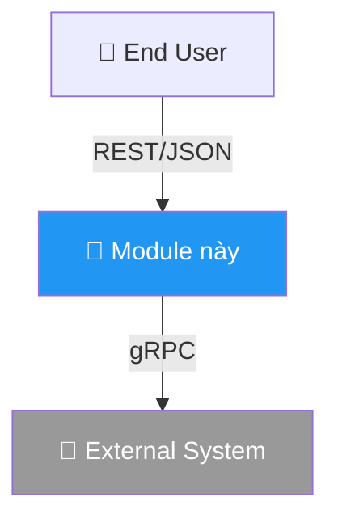
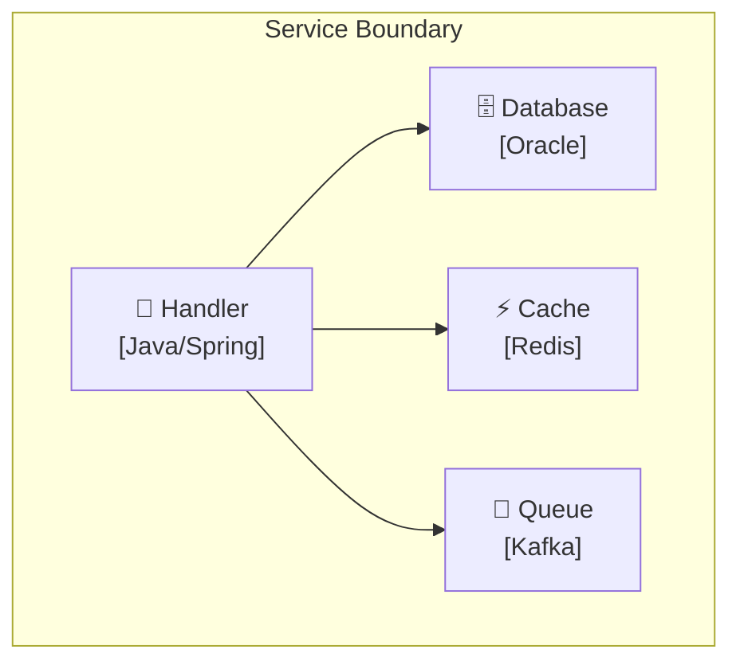

# Hướng dẫn Sơ đồ Kiến trúc — C4 + Mermaid

> Tài liệu tham khảo cho skill `infra-tdd`. Load khi vẽ sơ đồ (Bước 3).

---

## Mô hình C4

| Cấp | Tên | Đối tượng | Hiển thị |
|-----|-----|----------|----------|
| **L1** | System Context | PM, stakeholder | Hệ thống + actors/systems ngoài |
| **L2** | Container | Architect | Deployable units (services, DBs, queues) |
| **L3** | Component | Dev lead | Classes/modules chính trong 1 container |
| **L4** | Code | Developer | UML chi tiết (hiếm khi cần) |

**TDD luôn cần ít nhất L1 + L2.** L3 chỉ cho module phức tạp. L4 không cần.

---

## 3 Annotation bắt buộc

Mỗi sơ đồ **PHẢI** có:

### 1. Ranh giới Trust / Failure
Chỉ rõ đâu là trust boundary (internal → external) hoặc failure domain.

### 2. Data Contract trên mỗi mũi tên
- Protocol (REST, gRPC, Kafka, JDBC)
- Payload type (JSON, Protobuf)
- Sync/Async + Retry policy

**❌ Sai**: `A --> B`
**✅ Đúng**: `A -->|"gRPC/Protobuf, timeout 3s, retry 2x"| B`

### 3. Failure Mode
Mỗi mũi tên → trả lời: "Chuyện gì xảy ra khi fail?"

| Connection | Failure mode | Impact | Mitigation |
|-----------|-------------|--------|------------|
| Service → DB | Network partition | Write fail | Retry + circuit breaker |
| Service → Redis | Redis down | Lock unavailable | Fallback degraded |

---

## Cú pháp Mermaid

### Level 1 — System Context

### Level 2 — Container

**Quy tắc**: Mỗi container = 1 deployable unit. Technology stack trong [brackets].

### Level 3 — Component

Chỉ hiển thị component quan trọng. Ghi design pattern trong [brackets].

### Sequence Diagram

**Bắt buộc ít nhất 1** cho luồng chính. Phải có cả happy path + error path (dùng `alt`).

---

## Anti-patterns

| Anti-pattern | Cách sửa |
|-------------|----------|
| Sơ đồ > 15 nodes | Tách theo C4 levels |
| Mũi tên không annotation | Luôn ghi protocol + payload |
| Chỉ happy path | Thêm `alt` cho error cases |
| Sơ đồ không có prose | Thêm 1-2 đoạn mô tả |
| Sơ đồ không match code | Verify qua UA/Socraticode trước |
| Color không nhất quán | Dùng color scheme cố định |

## Color Scheme

| Màu | Dùng cho | Hex |
|-----|----------|-----|
| 🔵 Xanh dương | Service chính | `#2196F3` |
| 🟢 Xanh lá | Worker/background | `#4CAF50` |
| 🟣 Tím | Orchestrator/routing | `#9C27B0` |
| 🟠 Cam | Warning/config | `#FF9800` |
| 🔴 Đỏ | Error/reject | `#f44336` |
| ⬜ Xám | External system | `#999` |

## Checklist

- [ ] Có L1 + L2 tối thiểu
- [ ] Mỗi sơ đồ có prose đi kèm
- [ ] Mỗi mũi tên có annotation
- [ ] Trust/failure boundaries đánh dấu
- [ ] Failure modes liệt kê
- [ ] Có sequence diagram cho luồng chính
- [ ] Color scheme nhất quán
- [ ] Verify qua UA/Socraticode
