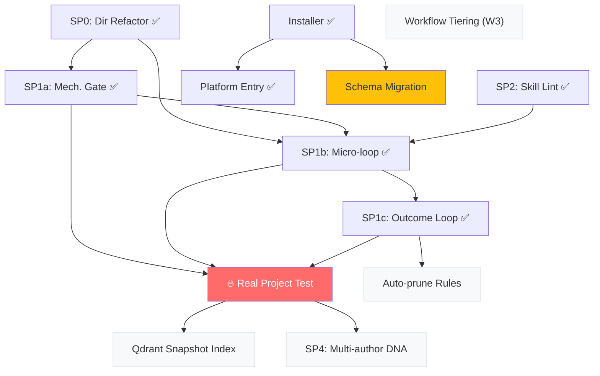

# 🔍 AMAP v3.0 Deep Review — Brainstorm Tiếp Tục

> **Ngày:** 2026-06-17 · **Phiên:** Brainstorm #2 (tiếp nối phiên 2026-06-16)
> **Mục tiêu:** Đánh giá tiến trình sau khi implement, phát hiện gap mới, xác định hướng tiếp theo.

---

## 0. Tóm tắt Tiến độ Tổng Thể

Từ bản assessment gốc (2026-06-16) đến nay, AMAP đã ship **76 commits** trên `main`, hoàn thành phần lớn roadmap 3 increment. Dưới đây là bảng theo dõi:

```
[████████████████████░] SP0  — Directory Refactor          ✅ DONE (merged)
[████████████████████░] SP1a — Mechanical Enforcement      ✅ DONE (rule-projector, Checkstyle backend, IR)
[████████████████████░] SP1b — Coding Micro-loop           ✅ DONE (orchestrator, tiers, extraction, PR merged)
[████████████████████░] SP1c — Outcome Loop                ✅ DONE (outcome.py, stats.py, gate enrichment)
[████████████████████░] SP2  — Skill Standardization       ✅ DONE (14/14 skills PASS lint gate)
[████████████████████░] Installer — install.sh + CLI       ✅ DONE (init/update/reconfigure, atomic writes)
[████████████████████░] Platform Entry Point               ✅ DONE (templatized, Cursor test, status fix)
[░░░░░░░░░░░░░░░░░░░░] SP3  — Portability Adapter Layer   🔶 PARTIAL (adapter POC merged, but skills still hardcode tools)
[░░░░░░░░░░░░░░░░░░░░] SP4  — Multi-author DNA            ❌ NOT STARTED
[░░░░░░░░░░░░░░░░░░░░] Qdrant Index (snapshot)            ❌ NOT STARTED (deferred to SP1c/SP3)
```

---

## 1. Reassessment: 9 Điểm Yếu Gốc (W1–W9) — Đã Giải Quyết?

| # | Điểm yếu gốc | Trạng thái | Giải pháp đã ship | Còn lại |
|---|---|---|---|---|
| W1 | **Deterministic guardrail chạy bằng prose** | ✅ **GIẢI XONG** (phần cơ học) | SP1a Rule Projector: DNA → IR → Checkstyle → git pre-commit. ~50% DNA rules giờ là machine-enforced. | Phần semantic (~50% còn lại) vẫn là prose — nhưng giờ chạy trên surface nhỏ (SP1b) thay vì monolithic |
| W2 | **Compliance theater** | ✅ **GIẢI XONG** | SP1a gate chạy deterministic (code, không phải self-report). SP1c outcome loop đo *kết quả thật* (trigger count, resolved rate) thay vì "tôi đã check" | Audit trail văn bản (AGENT_TRANSPARENCY) vẫn là theater — nhưng giờ nó là *supplement*, không phải *gate chính* |
| W3 | **Overhead lớn, workflow không phân tầng** | 🔶 **GIẢM THIỂU** | SP1b micro-loop tách task → mỗi unit nhẹ. Execution-mode tier cho phép degrade (inline-reload). Tiered DNA loading giữ nguyên. | Workflow Pha 1 (exploration) vẫn chưa phân tầng — bugfix nhỏ vẫn full pipeline scan |
| W4 | **Token overhead cho bookkeeping** | 🔶 **GIẢM THIỂU** | Handoff slice (SP1b) chỉ gửi DNA entry liên quan, không dump cả file. Gate chạy ngoài model (pre-commit). | TOKEN_LOG + AGENT_TRANSPARENCY vẫn là overhead bookkeeping. Chưa có cơ chế auto-decide "bỏ qua logging cho task đơn giản" |
| W5 | **Coupling cứng ở tầng TOOL** | 🔶 **PARTIAL** | SP3 POC merged (adapter layer concept). SP1b execution-mode tách dispatch khỏi logic. Platform entry point templatized. | Skills/workflows vẫn hardcode tool names (`{{ tools.X }}`). Adapter layer chưa penetrate vào skill bodies đầy đủ — chỉ là thin wrapper |
| W6 | **Không có outcome loop** | ✅ **GIẢI XONG** | SP1c: outcome.py + stats.py. Rules triggered/silent tracking, quality trend, prune candidates. | Auto-prune chưa có (user-driven qua stats output). Dashboard UI chưa có (CLI only) |
| W7 | **Friction đẩy sang con người** | 🔶 **GIẢM THIỂU** | Execution-mode tier có `inline-reload` (đơn session). Micro-loop tự resume từ TASK_QUEUE sau truncation. | `fresh-session` tier vẫn yêu cầu user mở session mới thủ công. Không có auto-session-split |
| W8 | **DNA đơn-tác-giả** | ❌ **CHƯA** | Chưa bắt tay vào. | Chưa có cơ chế merge/namespace DNA nhiều tác giả. Project mới = DNA rỗng = generic |
| W9 | **Gate trùng lặp** | 🔶 **GIẢM THIỂU** | SP1b tách rõ: cơ học → SP1a gate (1 điểm duy nhất). Semantic → surface-check per-task (1 điểm). DNA-RELOAD → slice trong handoff (cấu trúc, không nghi thức). | spec-validator vẫn có overlap với semantic surface-check. Chưa có dedup formal |

### Verdict

**5/9 giải xong hoặc gần xong** (W1, W2, W5 partial, W6, W9 partial).
**3/9 giảm thiểu** (W3, W4, W7).
**1/9 chưa bắt tay** (W8).

> [!TIP]
> Kết quả tốt hơn kỳ vọng cho 1 ngày sprint. Vấn đề cốt lõi nhất (W1 — deterministic prose) đã có giải pháp thật. Phần còn lại chủ yếu là optimisation, không phải structural failure.

---

## 2. Gap Mới Phát Hiện Trong Quá Trình Implement

### G1: **Operational Testing Gap — Framework chưa chạy end-to-end trên dự án thật**

SP1a/SP1b/SP1c đã test bằng fixture trong repo AMAP, nhưng:
- Rule Projector chưa chạy Checkstyle thật trên file `.java` (chỉ XML generation).
- Micro-loop orchestrator chưa chạy với real subagent/real file generation.
- Outcome loop chưa có data thật để validate stats.py output hữu ích.

**Risk:** Fixture-based testing chứng minh *logic đúng*, nhưng không chứng minh *flow chạy được* trên project thật (vd: Checkstyle version compatibility, topo-sort trên spec phức tạp, extraction review trên codebase lớn).

**Recommendation:** Chạy SP1a+SP1b+SP1c trên **1 task thật** trong `vietbank-sme-omni` (dự án đích đã cài AMAP). Đây là litmus test quan trọng nhất.

### G2: **Persona chưa customize — template đang dogfood**

`.knowledge-layer/long-term/persona.yaml` vẫn là template gốc (user `<your-username>`, giọng generic). Bootstrap report xác nhận điều này. Mọi phiên đều chạy giọng mặc định — persona layer chưa phát huy tác dụng.

**Risk:** Thấp (functional, không phải structural). Nhưng cho thấy DX (developer experience) cho persona flow chưa được "dog-food".

### G3: **`resolved-config.yaml` missing trong repo AMAP**

Repo AMAP là *installer tool*, không phải *target project*. `amap init` chưa chạy trên chính repo này → resolved-config thiếu. Nhưng các file framework trong repo vẫn chứa `{{ }}` template markers — khi agent đọc trực tiếp, nó thấy literal markers thay vì tool names.

**Impact:** Khi dogfood AMAP (chạy skills/workflows trên chính repo này), tool names trong SKILL.md chưa được resolve → agent có thể gọi sai tool hoặc bị confuse bởi `{{ tools.X }}` raw.

**Decision đã chốt (platform entry point spec):** "Source == template" — nhất quán. Để dogfood thì render qua `amap init`. Chấp nhận.

### G4: **Installer safety — nhưng chưa có upgrade path cho breaking changes**

`amap update` re-render framework files, preserve user files. Nhưng nếu version mới đổi schema của `author-dna.yaml` (vd: thêm `check_spec`) → user file không được update vì `ownership: user`.

Spec installer §8 đã ghi nhận: *"update không add missing files vào user-owned dir"*. Nhưng schema migration (field mới trong file cũ) còn nghiêm trọng hơn missing files — file tồn tại nhưng thiếu field mới.

**Recommendation:** Cần `amap migrate` hoặc version-aware schema upgrade trong `amap update`.

### G5: **SP3 Adapter POC merged nhưng chưa penetrate**

Adapter layer POC (`5e0cee9`) merged, nhưng skills/workflows vẫn dùng `{{ tools.X }}` — đây là *template-level* resolution (build-time), không phải *runtime capability abstraction*. Installer design spec đã chốt build-time approach, nên SP3 cũ (runtime adapter) coi như deprecated.

Tuy nhiên, **capability-based routing** (skill nói "tôi cần `explore_code` capability" thay vì hardcode tool name) — ý tưởng hay nhưng **chưa implement**. Build-time resolution là MVP đủ tốt; capability layer là enhancement.

---

## 3. Maturity Matrix — Mức Trưởng Thành Từng Thành Phần

| Component | Design | Implement | Test (fixture) | Test (real project) | Docs | Production-Ready? |
|---|---|---|---|---|---|---|
| Rule Projector (SP1a) | ✅ | ✅ | ✅ | ❌ | ✅ | 🟡 Need real-project test |
| Micro-loop Orchestrator (SP1b) | ✅ | ✅ | ✅ | ❌ | ✅ | 🟡 Need real-project test |
| Outcome Loop (SP1c) | ✅ | ✅ | ✅ | ❌ | ✅ | 🟡 Need real data |
| Skill Lint (SP2) | ✅ | ✅ | ✅ | ✅ (14/14 PASS) | ✅ | ✅ Production-ready |
| Installer (init/update) | ✅ | ✅ | ✅ | ✅ (SME Omni) | ✅ | ✅ Production-ready |
| Platform Entry Point | ✅ | ✅ | ✅ (Cursor test) | 🔶 (Antigravity only) | ✅ | ✅ Production-ready |
| Execution-mode Profiles | ✅ | ✅ | ✅ (degradation) | ❌ | ✅ | 🟡 Need real subagent |
| Extraction Review | ✅ | ✅ | ✅ (disk-fallback) | ❌ | ✅ | 🟡 Need real codebase |
| DNA Schema Extension | ✅ | 🔶 (sample only) | ❌ | ❌ | ✅ | 🟡 Need real DNA |
| Adapter Layer (SP3) | 🔶 (POC) | 🔶 (POC) | ❌ | ❌ | 🔶 | ❌ POC only |
| Multi-author DNA (SP4) | ❌ | ❌ | ❌ | ❌ | ❌ | ❌ Not started |

---

## 4. Dependency Graph — Gì Unblock Gì



---

## 5. Đề Xuất Ưu Tiên Tiếp Theo

### 🔥 P0 — Real Project Litmus Test (ngay bây giờ)

**Mô tả:** Chạy SP1a + SP1b + SP1c trên **1 task thật** trong `vietbank-sme-omni`.

**Vì sao P0:** Toàn bộ SP1 suite đã design+code+fixture-test nhưng **chưa bao giờ chạy end-to-end**. Một lần chạy thật sẽ:
1. Validate rule-projector sinh Checkstyle chạy được trên `.java` thật.
2. Validate micro-loop topo-sort + handoff + gate + mark-done trên spec thật.
3. Validate outcome-log có data hữu ích để stats.py xuất report có ý nghĩa.
4. Phát hiện friction/bug mà fixture không cover.

**Deliverable:** 1 ticket qua đầy đủ Pha 1 → Pha 2 → Pha 3 (micro-loop) → archive → outcome report.

### 🟡 P1 — Schema Migration cho `amap update` (G4)

**Mô tả:** Khi AMAP version mới thêm field vào `author-dna.yaml` (vd `check_spec`), `amap update` cần hỗ trợ migrate schema user files mà không mất data.

**Approach:** 
- `amap update --migrate`: diff schema current vs expected, suggest additions.
- Hoặc đơn giản hơn: `amap update` detect version mismatch → print migration guide.

### 🟢 P2 — Workflow Tiering (W3 — giảm overhead cho task đơn giản)

**Mô tả:** `/task` Pha 1 hiện chạy full pipeline cho mọi task. Bugfix nhỏ (1 file, không chạm DB) không cần db-explorer, architecture-reviewer, hay full DNA reload.

**Approach:**
- Task complexity classifier ở đầu `/task`: `tiny | standard | complex`.
- `tiny`: skip db-explorer + architecture-reviewer, lightweight REQUIREMENT.
- `standard`: flow hiện tại.
- `complex`: full + mandatory UA graph.

### ⚪ P3 — Multi-author DNA (W8 — khi mở rộng team)

**Mô tả:** Khi \> 1 dev contribute, DNA cần namespace hoặc merge strategy.

**Approach options:**
1. **Namespace per-author:** `author-dna-{username}.yaml` + merge utility.
2. **Team DNA vs Personal DNA:** `team-dna.yaml` (shared, reviewed) + `author-dna.yaml` (personal overlay).
3. **Inheritance:** `base-dna.yaml` (org-wide) → `team-dna.yaml` → `author-dna.yaml`.

### ⚪ P4 — Qdrant Index cho Knowledge Snapshot

**Mô tả:** Khi snapshot phình to, đọc thẳng section không scale. Vector search cho phép slice relevant context.

**Precondition:** Snapshot phải đủ lớn để justify overhead. Hiện ~14KB — chưa cần.

---

## 6. Những Điều Đã Làm Đúng (Cần Bảo Vệ)

> [!IMPORTANT]
> Những quyết định kiến trúc sau đây đã chứng minh đúng qua implementation và PHẢI được bảo vệ trong các iteration tiếp theo:

1. **IR trung lập (SP1a):** JSON IR giữa DNA và Checkstyle backend. Thêm ngôn ngữ/linter chỉ thêm backend, không sửa projector. Đây là pattern đúng.

2. **Filesystem-based contract (SP1b):** TASK_QUEUE, TASK_HANDOFF, TASK_RESULT trên disk. Resume-safe, platform-agnostic, debug-friendly. Đây là insight quan trọng nhất của SP1b.

3. **Execution-mode tier (SP1b):** 3 tier (subagent/fresh-session/inline-reload) với cùng contract. Thay đổi platform = thay 1 dòng config. Đã test degradation.

4. **Build-time resolution (Installer):** Template markers `{{ }}` resolve lúc `amap init`, không runtime. Đơn giản, debuggable, portable. Runtime adapter approach (SP3 cũ) đã đúng khi bị retire.

5. **Outcome loop append-only (SP1c):** Git-tracked, diff-friendly, không phức tạp hoá. Stats CLI đủ tốt cho giai đoạn này.

6. **Skill lint gate (SP2):** 14/14 PASS. Schema enforcement bằng code, không bằng prose. Đúng tinh thần W1/W2.

---

## 7. Rủi Ro Cần Theo Dõi

| Risk | Severity | Mitigation |
|---|---|---|
| **SP1 suite chưa chạy thật** — mọi thứ chỉ là fixture test | 🔴 HIGH | P0: chạy 1 ticket thật trên vietbank-sme-omni |
| **Schema migration gap** (G4) — update không migrate user files | 🟡 MEDIUM | P1: thêm version-aware migration |
| **Persona chưa dogfood** — DX flow chưa verify | 🟢 LOW | Customize persona.yaml, chạy 1 phiên xem hiệu ứng |
| **DNA `check_spec` chưa populated** — sample chỉ minh hoạ | 🟡 MEDIUM | Khi chạy P0, populate check_spec cho DNA thật |
| **Rule bloat bắt đầu** — 5 rule files + 14 skills + 3 procedures | 🟡 MEDIUM | Outcome loop (SP1c) stats.py sẽ detect silent rules; manual prune |
| **Context overhead chưa đo** — chưa biết bootstrap + handoff slice tốn bao nhiêu token thật | 🟡 MEDIUM | P0 sẽ cho data; TOKEN_LOG ghi checkpoint |

---

## 8. Câu Hỏi Mở Cho Anh

1. **P0 — Chạy thật trên vietbank-sme-omni:** Anh muốn chọn ticket nào làm litmus test? (Ideally 1 task standard complexity, có DB + code change, 2-3 files).

2. **Workflow tiering (P2):** Anh có thấy overhead ở Pha 1 exploration cho bugfix nhỏ không? Nếu có thì đây là P1 chứ không phải P2.

3. **Multi-author DNA (P3):** Hiện có ai ngoài anh contribute code vào SME Omni không? Nếu chỉ 1 người thì W8 deprioritize được.

4. **Rule Projector mở rộng:** Ngoài Checkstyle (Java), có cần backend nào khác không? (ESLint, Ruff, Ktlint...)

5. **Outcome stats — prune threshold:** SP1c default là 5 ticket silent → prune candidate. Anh cảm thấy con số này hợp lý chưa?

---

> **Bottom line:** Framework đã chuyển từ "prose-only guardrails" sang "hybrid mechanical + semantic" — đây là bước nhảy vọt lớn nhất. Bước tiếp quan trọng nhất là **chạy thật 1 lần** (P0) để validate toàn bộ pipeline end-to-end, trước khi tối ưu thêm bất kỳ thứ gì.
